# Synesthesia: a guide

*For Freeman. Everything you need to use the instrument on your own.*

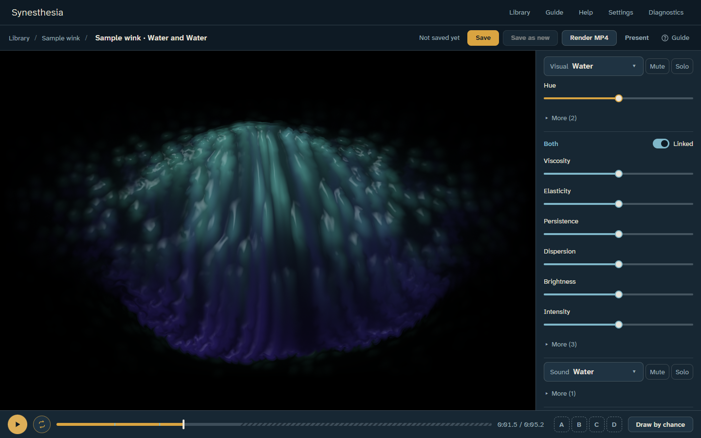

## The idea

Picture lying at the bottom of a bowl of colored water, looking up. A finger traces a path
through the water above. You never see the finger, only its wake. Now picture the same
movement in a bowl of honey: the same movement, a different response.

Synesthesia keeps the movement from a short clip as a **signature**: where things moved,
which way, how fast, and when. It keeps no picture of the clip. That one signature can then
move through different **materials**, visual ones (water, honey, smoke, bubbles,
filaments) and sound ones (water, honey, breath, resonance, pulse). Each material has
**properties** you can play with, such as viscosity or persistence. The movement stays
constant; the wake changes.

Nothing here labels or interprets a movement. You are the only authority on what, if
anything, becomes noticeable.

This is a first playable version, **v0**, meant for you to co-direct: every choice made
while building it is written down in Braden's log of decisions, so you can revisit any of them.

## Before you start

- Use **Google Chrome** on your MacBook. Other browsers aren't supported yet.
- Your work lives **in Chrome on this computer**, not online. Back it up now and then (see
  [Keeping your work safe](#keeping-your-work-safe)).
- After your first visit, the instrument works without the internet.
- The first time you open the Studio, it spends about three seconds "getting to know this
  computer" to choose how detailed the preview can be.

The first time you open it, a short introduction offers to start with a **sample wink** or
with a clip of your own. You can show the introduction again from Settings.

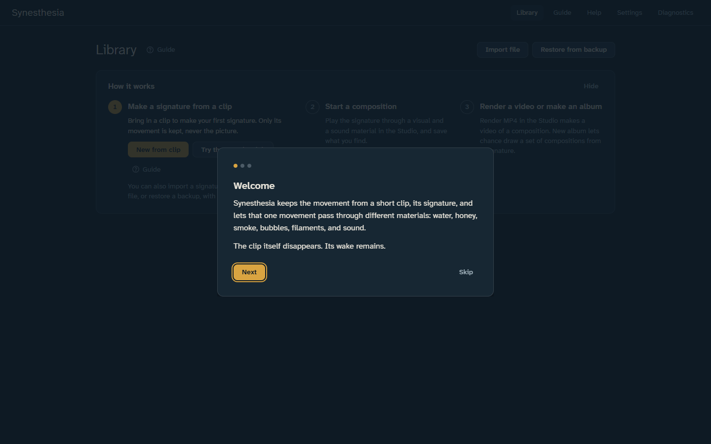

The whole journey has three steps: make a **signature** from a clip, start a
**composition** from it in the Studio, then **render a video** of it or **make an album**.
The Library shows these steps, and every screen has a small **Guide** link (a question mark)
that opens this guide where it explains that screen.

## The Library

The Library is home. It lists your **signatures**, **albums** and **compositions**, each
with a small picture of its wake.

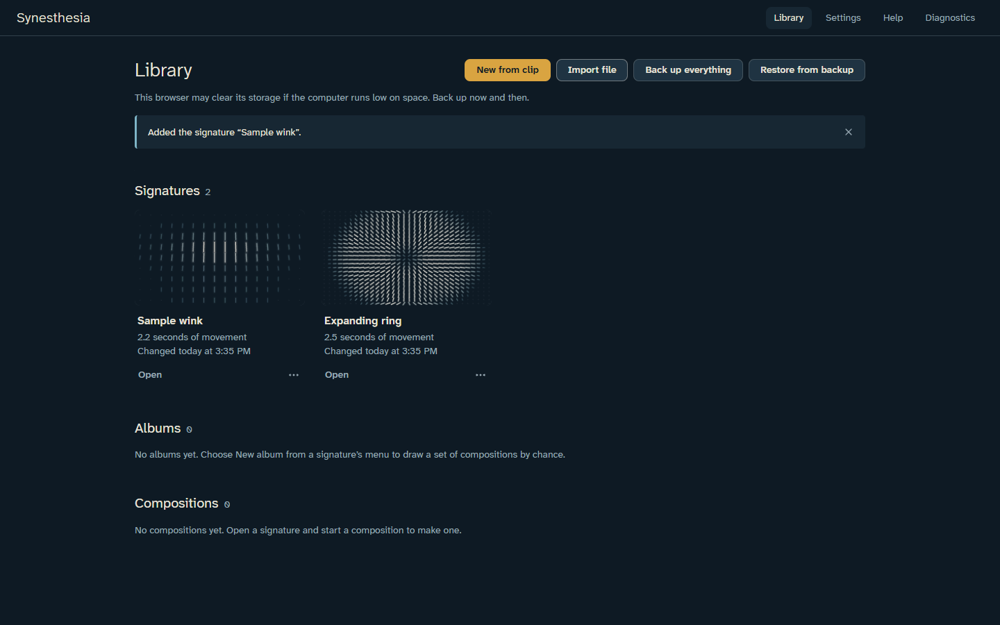

**How it works**, at the top, shows the three steps. The step to take next has its buttons
and a **Guide** link; finished steps get a tick. With nothing in the Library yet, it offers
**New from clip** and **Try the sample wink**. **Hide** puts it away; **Show how it works** in
Settings brings it back.

- **New from clip** starts a new signature. You can also drop a video file anywhere on the
  window.
- Each signature has **Start a composition**, which opens it in the Studio, and **New
  album**, which lets chance draw a set of compositions from it. Choose its picture to see
  its bare wake and its movement over time, with the same two ways forward.
- Choose a composition's or an album's picture, or **Open**, to open it.
- The "…" button beside each item holds **Rename**, **Duplicate**, **Export file** and
  **Delete** (for an album: **Rename**, **Export album log** and **Delete**). **Export file**
  saves a signature or composition as a file to share or keep.
- **Import file** brings in a signature, composition or album file.
- **Back up everything** and **Restore from backup**: see
  [Keeping your work safe](#keeping-your-work-safe).

## Making a signature (Prepare)

1. **Bring in a clip.** Drop a video onto the window, or choose **Choose a clip…**. Short
   is best: a signature holds up to a minute of movement. MP4, MOV or WebM.
2. **Trim it.** Drag the handles under the clip to where the movement starts and ends, or
   step to a frame and use **Start here** and **End here**. The preview loops inside your
   trim so you can watch the movement again and again.
3. **Speed** sets how fast the signature plays by default. It doesn't change what's
   captured.
4. **Turn or mirror** the clip if it came out sideways.
5. **Box the part that moves** (optional, but best for a wink): drag on the clip to draw a
   box around the eye. Only the movement inside the box is kept, and it's stretched to fill
   the material. Drag the box to move it, or its corners to resize it.
6. **Extract signature.** A bar shows the progress; a 10-second clip takes well under a
   minute. **Cancel** stops it.

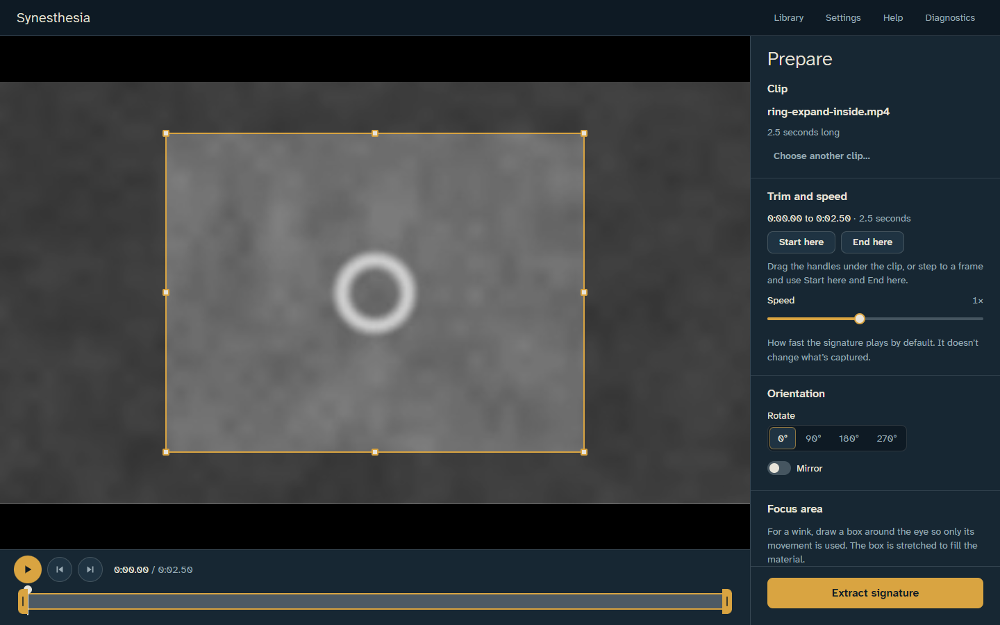

When it's done you see the **bare wake**: a short stroke for each part of the picture,
pointing the way it moved and brighter where it moved faster. The clip is hidden (turn
**Hide source** off to see them side by side). Below, lines show the movement over time:
**energy** (how much is moving), **direction**, **expansion and contraction**,
**continuity** (smooth or jolting) and **density** (how much of the frame moves). Small
marks show **moments of sudden movement**.

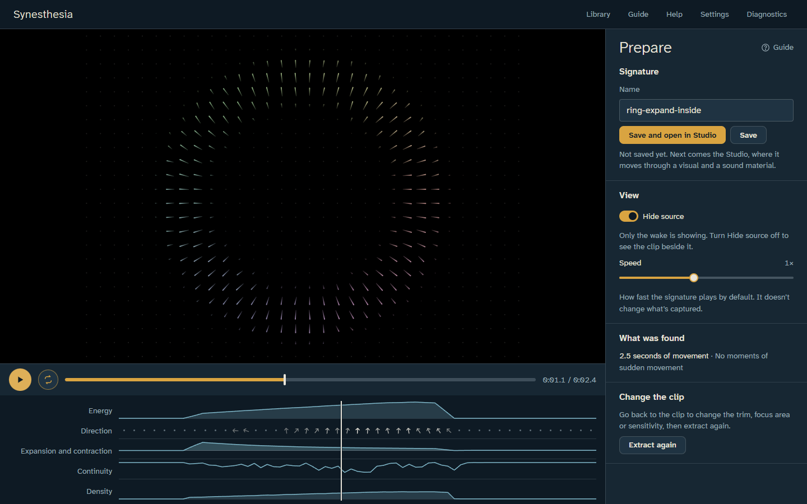

Name the signature and choose **Save and open in Studio** to go straight on and play it, or
**Save** to keep it and stay here. The clip itself stays on this screen and is never kept.

**If it looks faint:** a clip that moves the whole time (water, a curtain) can fool the
automatic sensitivity. Prepare says so; choose **Extract again**, open **Advanced**, turn on
**Set sensitivity by hand** and raise **Sensitivity**, then **Extract signature**.

## The Studio

The Studio is where you play. The wake fills most of the screen; it stays dark until you
press **Play** (the first time the Studio opens, a note says so).

- **Play** (or Space) plays the signature through the materials; **Loop** repeats it. The
  bar at the bottom shows where you are; the small marks are moments of sudden movement,
  and the striped end is the **tail**, where the wake settles after the movement ends.
- **Visual** and **Sound** each have a material picker. Choosing another material keeps
  your shared settings, so you can compare the same movement in water and in honey.

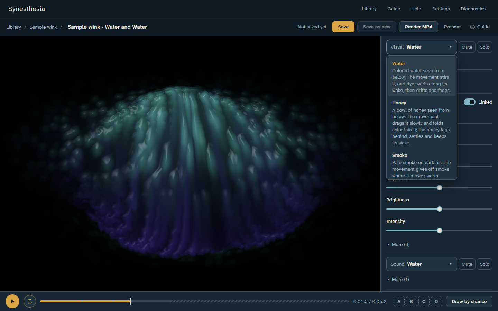

- **Properties.** With **Linked** on, the sliders under **Both** move sight and sound
  together, because a shared property means the same thing in each (see the table below).
  Turn Linked off to set them separately. **More** shows the less-used properties.
  Double-click a slider to return it to the material's baseline; hold Shift while dragging
  for fine control; arrow keys nudge.
- **Hue**, under the visual material, turns all of its colors around the color wheel
  together. The middle is the material's own colors, and the two ends of the slider meet
  half a turn away. It works while paused, and a video shows the same colors. Each
  material starts in its own colors when you choose it.
- **Mute** and **Solo** let you study the picture or the sound alone.
- **Movement** holds settings for the signature itself: **Signature strength** (how hard it
  pushes), **Smoothing**, **Speed**, **Loops**, **Repeat** (loop, or back and forth), and
  **Tail** (how long the wake settles afterwards).
- **Seed**: a six-digit number that fixes every chance choice, so a composition always
  replays the same way. **New seed** picks another.
- **Snapshots A, B, C, D**: click an empty letter to store the current version there; click
  a full one to switch to it while it plays; Shift-click it (on a touch screen, press and
  hold it) to replace it. (Keys: 1–4 to switch, Shift+1–4 to store.)
- **Notes** and **Status** (draft, kept, set aside) are part of the research record.
- To undo a change, press Cmd+Z; Shift+Cmd+Z redoes it. (These are keys only; there are no
  buttons for them.)
- **Present** (or F) shows only the wake, full screen. Esc comes back.
- **Save** keeps the composition in the Library with a small picture of its wake; **Save as
  new** keeps a copy. The Studio also saves your work in the background, so if Chrome
  closes unexpectedly, your changes come back the next time you open it.
- The first time you save a new composition, a note says what could come next: **Render
  MP4** makes a video of it, and **New album** lets chance draw an album from its signature.
- On a phone, **Save as new**, **Render MP4** and **Present** are in the "…" menu beside
  **Save**.

### Draw by chance

**Draw by chance** (or C) lets chance choose the visual and sound materials and open a few
shared properties for play. The other shared properties stay at their baseline, **locked**
(dimmed, with a lock). You can still unlock one; the composition notes that you did, so the
record stays honest. The same seed always draws the same way. **Open properties** says how
many it opens; with **Also choose values** on, chance sets where they start, too.

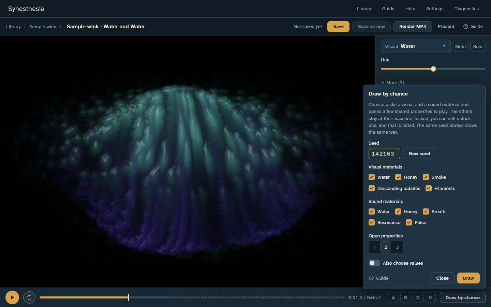

## Rendering a video

**Render MP4** (or R) in the Studio makes a video of the composition, frame by frame, at
full quality however long it takes.

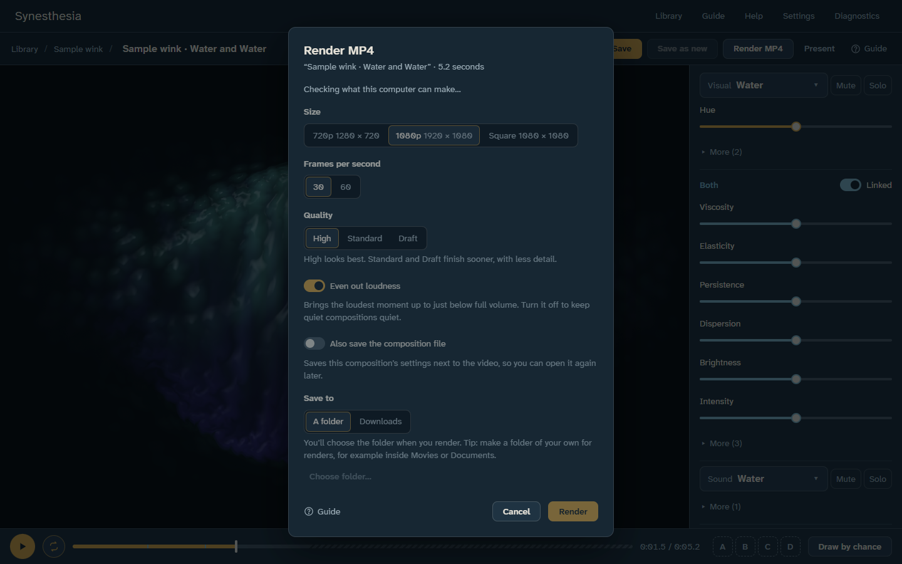

- **Size**: 720p, 1080p, or Square. **Frames per second**: 30 or 60.
- **Even out loudness** makes the loudest moment of every video the same level. Turn it off
  to keep quiet compositions quiet.
- **Save to**: a folder you choose (make one of your own inside Movies, for example) or your
  Downloads.
- A render can be cancelled; nothing half-made is left behind.

## Albums

An album gathers many compositions from one signature, as a body of work and a research
record. Start one with **New album** on a signature in the Library, or on the signature's
own page.

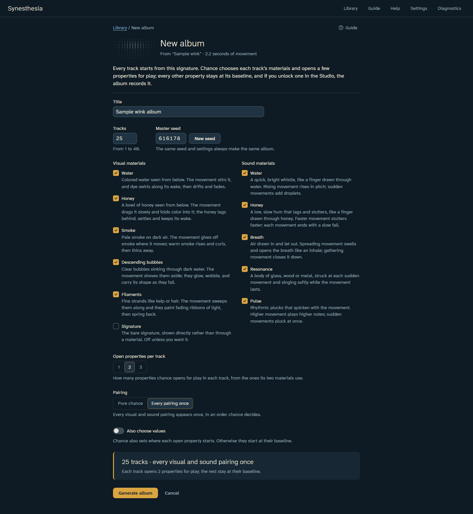

- Choose how many **tracks**, a **master seed**, which materials chance may use, how many
  properties each track opens for play, and the **pairing**: every visual and sound pairing
  once, or pure chance. The same master seed and settings always make the same album.
- **Also choose values**: chance also sets where each open property starts. Otherwise they
  start at their baseline.
- **Generate album** makes the drafts. The album's page lists the way through: choose **Open
  in Studio** on a track to play its open properties; mark it **Kept** or **Set aside**, and
  write notes. Nothing is thrown away: set-aside tracks stay in the record.

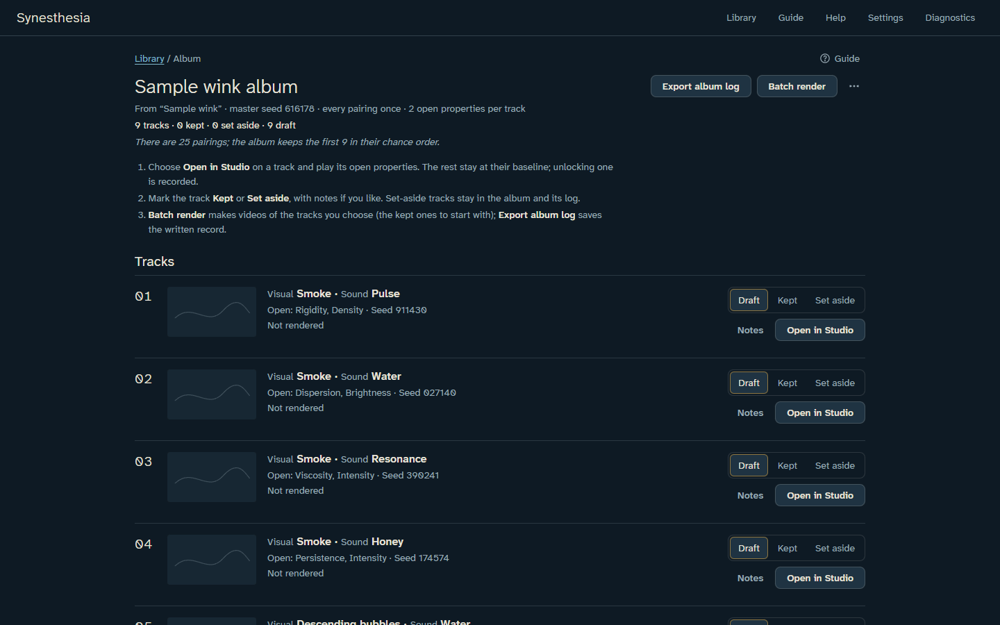

- **Batch render** makes videos of the chosen tracks (kept ones are chosen to start with)
  into one folder, one after another, unattended. You can pause or cancel it.
- **Export album log** saves `ALBUM_LOG.md`, a readable record of every track: its
  materials, open properties, final values, any unlocked properties, its seed, its video
  file, and your notes. (Chrome asks once whether it may save two files.)

## Settings

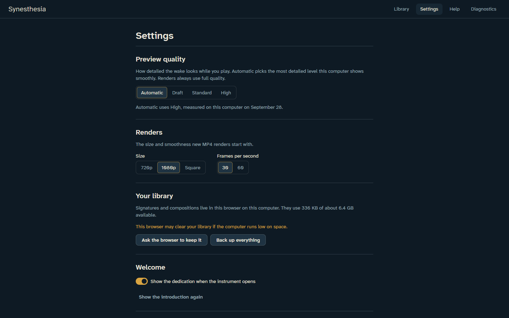

- **Preview quality**: Automatic picks the most detailed level this computer shows
  smoothly. If the Studio feels slow, choose a lower level. Videos always render at full
  quality.
- **Renders**: the size and frame rate new videos start with.
- **Your library**: how much space your work uses, whether Chrome has agreed to keep it,
  and **Back up everything**.
- **Welcome**: the dedication when the instrument opens; **Show how it works** (the steps
  at the top of the Library, the Studio's first note about Play, and its note on what could
  come next after you first save a composition); and the introduction, shown again.

## Keeping your work safe

Your signatures, compositions and albums are stored by Chrome on this computer. Chrome can
clear them if the computer runs very low on space, or if its data is cleared.

- **Back up everything** (Library or Settings) saves one `.spbackup.zip` file with all of
  it. Keep it somewhere safe (another drive, or cloud storage).
- **Restore from backup** (Library) brings it all back, on this computer or another.

## If something goes wrong

- **A clip won't open.** Some iPhone videos use a format Chrome can't read on every
  computer. On the iPhone, set **Settings › Camera › Formats › Most Compatible** and record
  again, or convert the clip to MP4.
- **The Studio is slow or jerky.** Lower **Preview quality** in Settings.
- **Something else.** Open **Diagnostics** (at the top right of the window; on a phone,
  under **Menu**), choose **Copy report**, and paste it into a message to Braden.

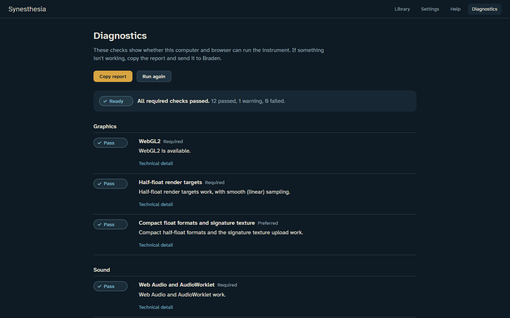

## Quick reference

### Shared properties

| Property | What you see | What you hear |
|---|---|---|
| Viscosity | How thick the material is: it resists flow, spreads slowly, lags behind the movement | How slowly the sound follows: longer glides, darker tone, softer attacks |
| Elasticity | How much it springs back and overshoots | How much the sound rings, bounces in pitch, and overshoots |
| Persistence | How long the wake stays visible | How long each sound lingers, and its reverb tail |
| Dispersion | How much the wake spreads, scatters, turns turbulent | How widely the sound spreads: stereo width, scatter, detuning |
| Brightness | How luminous and saturated the wake is | How bright the tone is |
| Intensity | How strongly the signature pushes the material | How loud and driven the sound is |
| Rigidity | How hard-edged and crisp shapes are | How sharp the attacks are; pitch snaps to a scale |
| Density | How much material there is | How many voices, grains or pulses |
| Range | From compressed to expanded: the scale of the movement | Pitch range, narrow to wide |

Every visual material also has **Hue**. It belongs to the picture alone: it is never
linked to the sound, and Draw by chance never locks it.

**Help** in the instrument lists every material and what each of its properties does.

### Keys (in the Studio)

| Key | Action |
|---|---|
| Space | Play or pause |
| L | Loop on or off |
| 1 – 4 | Switch to snapshot A – D |
| Shift + 1 – 4 | Store snapshot A – D |
| C | Draw by chance |
| S (or Cmd+S) | Save |
| R | Render MP4 |
| F | Present (Esc to leave) |
| Cmd+Z, Shift+Cmd+Z | Undo, redo |
